# docker-practice-4

Репозиторий для задания 4 курса "Проектирование и развертывание веб-решений в экосистеме Python". Магистерская программа Веб-технологии, Университет ИТМО, 2024

В задании нужно:

- создать контейнер с Nginx,
- создать контейнер с WSGI-сервером на Python,
- создать образ Nginx из Dockerfile,
- создать образ WSGI-сервера на Python из Dockerfile,
- загрузить образы в Docker Hub,
- использовать `docker-compose` для запуска Nginx и WSGI-сервера.

## Работа с портами и томами

### 1 Создание и запуск контейнера с Nginx

Чтобы запустить контейнер с Nginx, можно использовать команду:

```bash
docker run --name my-nginx -d -p 8081:80 nginx
```

Команда `docker run` запускает новый контейнер на основе указанного образа nginx. При помощи `--name` можно указать имя контейнера. Опция `-d` означает, что контейнер будет запущен в фоновом режиме. Опция `-p 8081:80` пробрасывает порт с хоста на контейнер: 8081 — это порт на хосте, а 80 — это порт внутри контейнера.

После этого можно использовать команду `docker ps`, чтобы посмотреть список запущенных контейнеров, в списке есть новый контейнер с именем **my-nginx**.

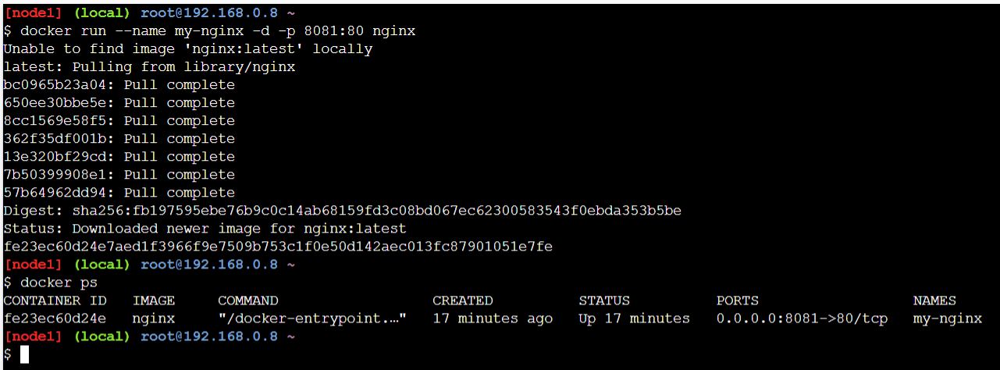

### 2 Создание и запуск контейнера с WSGI-сервером на Python

Для контейнера с WSGI-сервером на Python нужно создать директорию `app`, в директории создать файл `app.py`.

```bash
mkdir app
cd app
```

В `app.py` нужно добавить следующий код:

```python
# app.py
from flask import Flask
app = Flask(__name__)

@app.route("/")
def hello():
    return "Hello, WSGI World!"

if __name__ == "__main__":
    app.run(host="0.0.0.0", port=5000)
```

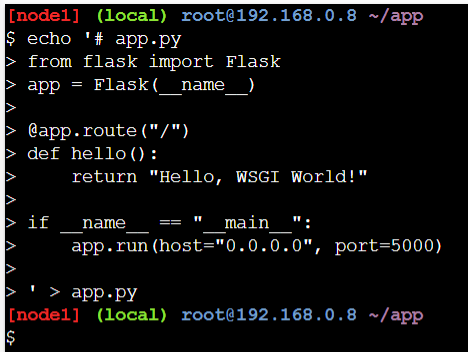

Создать и запустить контейнер можно при помощи команды:

```bash
docker run -d --name my-wsgi -p 8082:5000 -v $(pwd):/app -w /app python:3.9 bash -c "pip install flask && python app.py"
```

Эта команда создает и запускает контейнер с именем **my-wsgi** с Python 3.9, а также при помощи bash устанавливает Flask и запускает файл `app.py`.

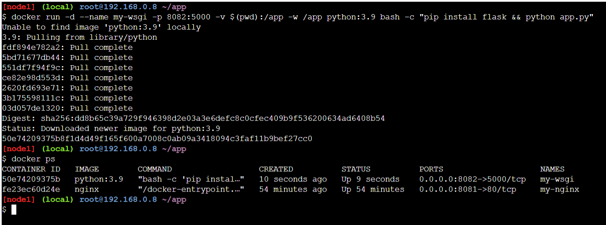

Опция `-p 8082:5000` пробрасывает порт 5000 внутри контейнера на порт 8082 хоста. Опция `-w /app` устанавливает /app в качестве рабочей директории контейнера — все команды внутри контейнера будут выполняться из этой директории.

### 3 Создание образа Nginx из Dockerfile

Чтобы создать Dockerfile для Nginx, нужно использовать команду:

```bash
echo -e "FROM nginx:latest\nCOPY ./index.html /usr/share/nginx/html/index.html" > Dockerfile
```

Команда создаст (или перезапишет, если файл уже существует) файл Dockerfile. Опция `-e` для команды `echo` позволяет интерпретировать специальные символы (например, символ переноса строки `\n`). В результате выполнения команды в файле Dockerfile окажется две строки:

```
FROM nginx:latest
COPY ./index.html /usr/share/nginx/html/index.html
```

Затем нужно создать файл `index.html`:

```bash
echo "<h1>Hello from Nginx!</h1>" > index.html
```

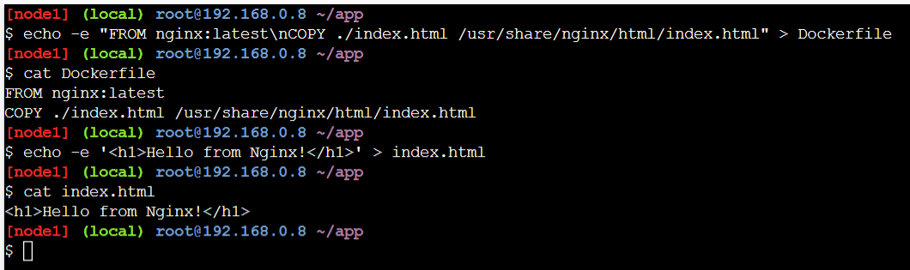

Собрать образ можно при помощи команды:

```bash
docker build -t my-nginx-image .
```

Опция `-t` используется, чтобы задать образу имя и тег. Символ `.` указывает на контекст сборки — это означает, что при сборке будет использован Dockerfile из текущей директории.

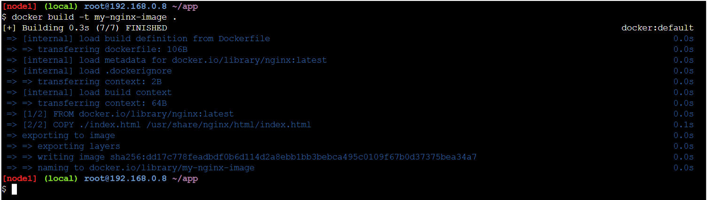

### 4 Создание образа WSGI-сервера на Python из Dockerfile

Создать Dockerfile для образа WSGI-сервера на Python можно при помощи команды:

```bash
echo -e 'FROM python:3.9\nWORKDIR /app\nCOPY app.py /app\nRUN pip install flask\nCMD ["python", "app.py"]' > Dockerfile
```

Результат выполнения команды:

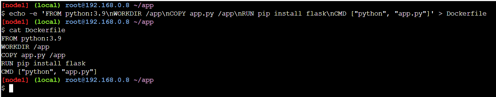

Для сборки образа нужно использовать команду:

```bash
docker build --network="host" -t my-wsgi-image .
```

Результат выполнения команды:

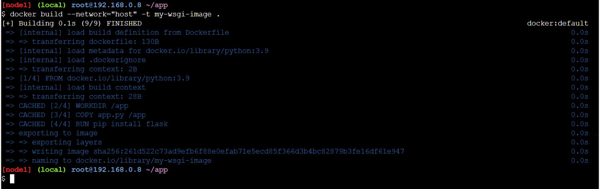

### 5 Загрузка образов в Docker Hub

Чтобы загрузить образы в Docker Hub, нужно сначала выполнить вход при помощи команды:

```bash
docker login
```

Для входа нужно перейти по URL и ввести одноразовый код для подтверждения:

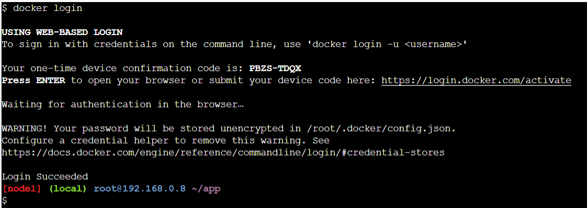

Для публикации образов на Docker Hub можно использовать команды:

```bash
docker tag my-nginx-image sstrawberrycheeks/my-nginx-image
docker push sstrawberrycheeks/my-nginx-image
```

Результаты выполнения команды для образа my-nginx-image:

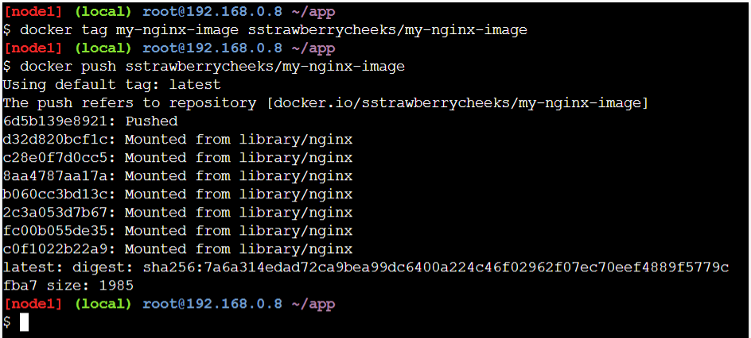

```bash
docker tag my-wsgi-image sstrawberrycheeks/my-wsgi-image
docker push sstrawberrycheeks/my-wsgi-image
```

Результаты выполнения команды для образа my-wsgi-image:

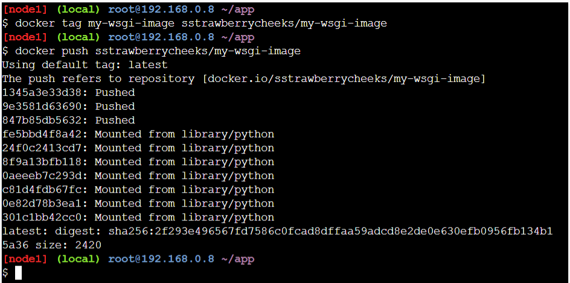

После этого опубликованные образы появятся в профиле:

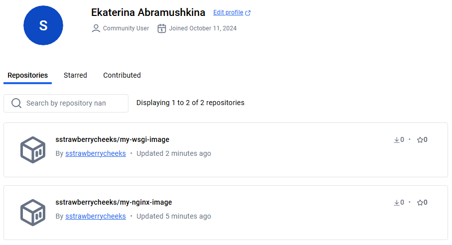

### 6 Запуск Nginx и WSGI-сервера на Python при помощи `docker-compose`

Чтобы создать файл docker-compose.yaml, нужно использовать команду:

```bash
echo -e "version: '3'\nservices:\n  nginx:\n    image: sstrawberrycheeks/my-nginx-image\n    ports:\n      - '8081:80'\n\n  wsgi:\n    image: sstrawberrycheeks/my-wsgi-image\n    ports:\n      - '8082:5000'" > docker-compose.yaml
```

Результат выполнения команды:

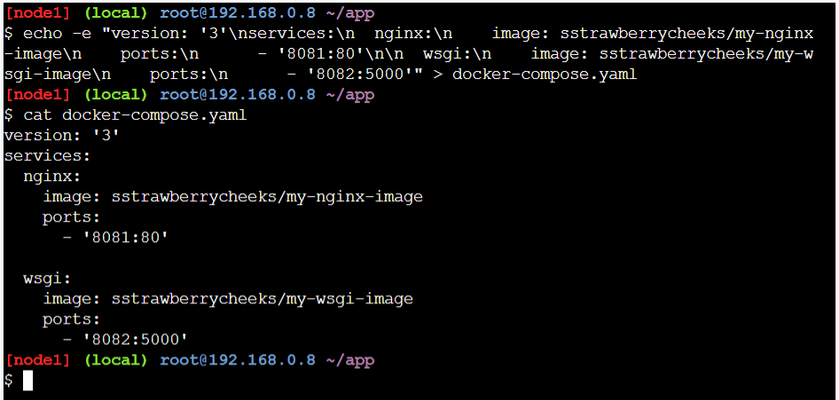

Для запуска контейнеров можно использовать команду:

```bash
docker-compose up -d
```

Результат выполнения команды:

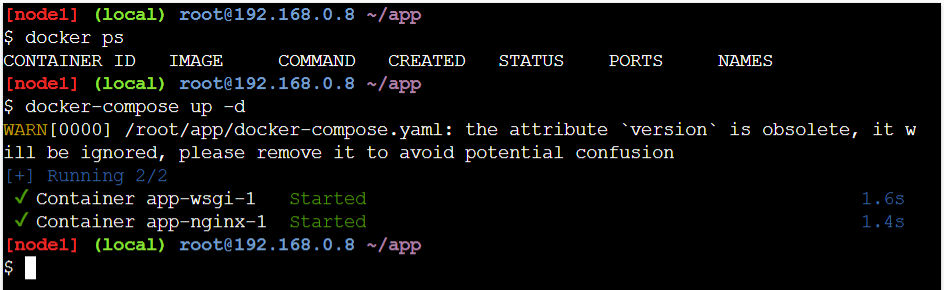
